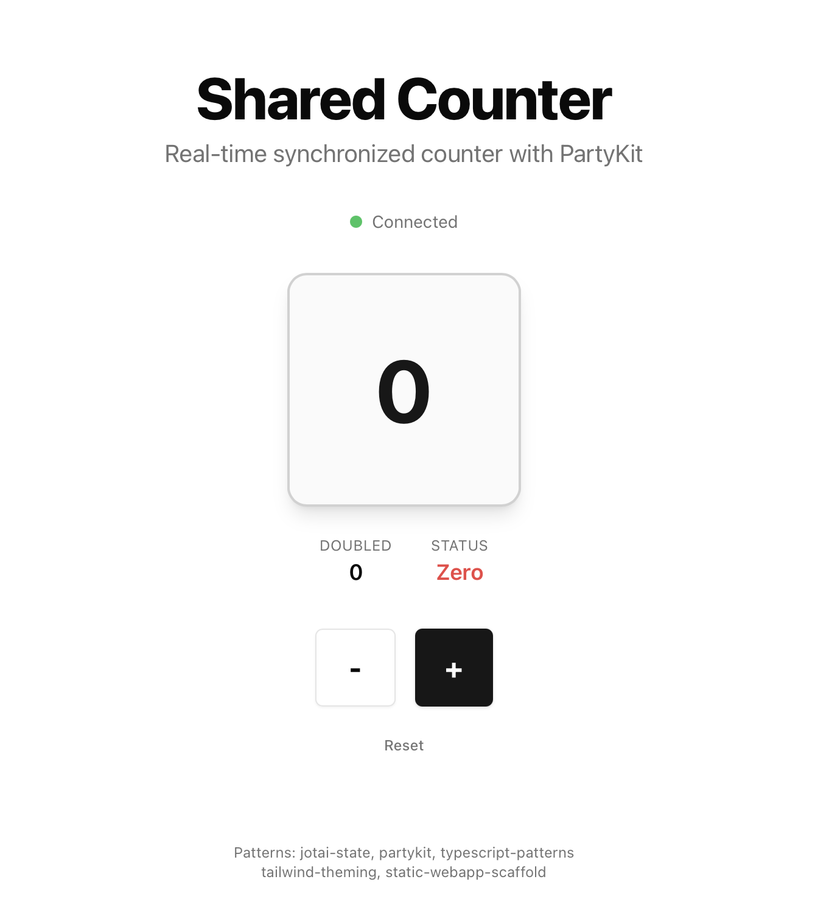

# Static Web App Template

A template for building static web applications with Next.js, React 19, TypeScript, Jotai, and Tailwind CSS.



## Tech Stack

| Category | Technology |
| -------------------- | -------------------------------------- |
| **Framework** | Next.js 16 (App Router, Static Export) |
| **Language** | TypeScript 5 |
| **UI Library** | React 19 |
| **State Management** | Jotai |
| **Styling** | Tailwind CSS v4 |
| **Error Handling** | @praha/byethrow (Result type) |

## Prerequisites

- [Nix](https://nixos.org/) - Reproducible development environment management

  ```bash
  # Install Nix (if not already installed)
  # macOS / Linux
  sh <(curl -L https://nixos.org/nix/install)

  # Enable flakes (if not already enabled)
  mkdir -p ~/.config/nix
  echo "experimental-features = nix-command flakes" >> ~/.config/nix/nix.conf
  ```

## Setup

Development environment with flake.nix and ni.
[antfu-collective/ni](https://github.com/antfu-collective/ni)

```bash
# Clone repository
git clone <repository-url>
cd <repository-name>

# Enter Nix development environment (installs all tools automatically)
nix develop

# Install dependencies
cd frontend
ni

# Setup environment variables
cp .env.example .env

# Start development server
nr dev

## Start PartyKit
npx partykit dev
```

The app will be available at http://localhost:3000/

## Development

### Development Environment

```bash
# Enter development environment (includes Node.js 20, oxlint, TypeScript, etc.)
nix develop

# After first setup, just use this command before starting work
nix develop
```

### Linting & Formatting

```bash
cd frontend

# Run linter
nr lint

# Auto-fix lint issues
nr lint:fix

# Run formatter (JS/TS)
nr format

# Check format only
nr format:check

# Format Nix/Markdown files (run from project root)
cd ..
nix fmt
```

### Pre-commit Hooks

This project uses automated pre-commit hooks for code quality:

- **nil** - Nix file linting
- **oxlint** - JavaScript/TypeScript linting with auto-fix
- **oxfmt** - JavaScript/TypeScript formatting

Hooks are automatically installed when you run `nix develop`.

### Tools managed by Nix

- **Node.js 24** - JavaScript runtime
- **oxlint** - Fast JavaScript/TypeScript linter
- **oxfmt** - Fast JavaScript/TypeScript formatter
- **mdformat** - Markdown formatter (via treefmt)
- **TypeScript** - Type checking
- **Git** - Version control

## Project Structure

```
frontend/src/
├── app/                    # Next.js App Router
│   ├── layout.tsx          # Root layout with metadata
│   ├── page.tsx            # Entry page
│   └── globals.css         # CSS variables & base styles
├── atoms/                  # Jotai state management
│   └── {domain}.ts         # Domain-specific atoms
├── components/
│   ├── ui/                 # Reusable UI components
│   └── {domain}/           # Domain-specific components
├── hooks/                  # Custom React hooks
│   └── use{Domain}.ts      # State access hooks
├── lib/                    # Business logic & utilities
│   ├── {domain}.ts         # Domain logic (pure functions)
│   └── utils.ts            # Generic utilities
└── types/                  # Type definitions
    ├── index.ts            # Centralized exports
    ├── {domain}.ts         # Domain types
    └── components.ts       # Component prop types
```

## Patterns & Skills

Each file includes pattern comments referencing the skill used:

```typescript
// Pattern: {skill-name} - {description}
```

### Skills Reference

| Skill | Purpose |
| -------------------------- | ----------------------------------------------------- |
| **jotai-state** | Atom design patterns (primitive, write-only, derived) |
| **tailwind-theming** | CSS variables & dark mode |
| **static-webapp-scaffold** | Directory structure & separation of concerns |
| **typescript-patterns** | Branded types, type guards, exhaustiveness |
| **byethrow** | Result type error handling |
| **frontend-design** | Clean, accessible UI |

## Using This Template

To create a new app from this template:

1. **Rename files**:

   - `atoms/counter.ts` → `atoms/{domain}.ts`
   - `components/counter/` → `components/{domain}/`
   - `hooks/useCounter.ts` → `hooks/use{Domain}.ts`
   - `lib/counter.ts` → `lib/{domain}.ts`
   - `types/counter.ts` → `types/{domain}.ts`

1. **Update types** in `types/`:

   - Create domain-specific branded types
   - Update component props
   - Update `types/index.ts` exports

1. **Update CSS variables** in `globals.css`:

   - Replace `--counter-*` with `--{domain}-*`

1. **Update Tailwind config** in `tailwind.config.ts`:

   - Replace `counter` color mappings with `{domain}`

## Deployment

Built for Cloudflare Pages (static export):

```bash
cd frontend
nr build
# Output: frontend/out/
```

## License

MIT
